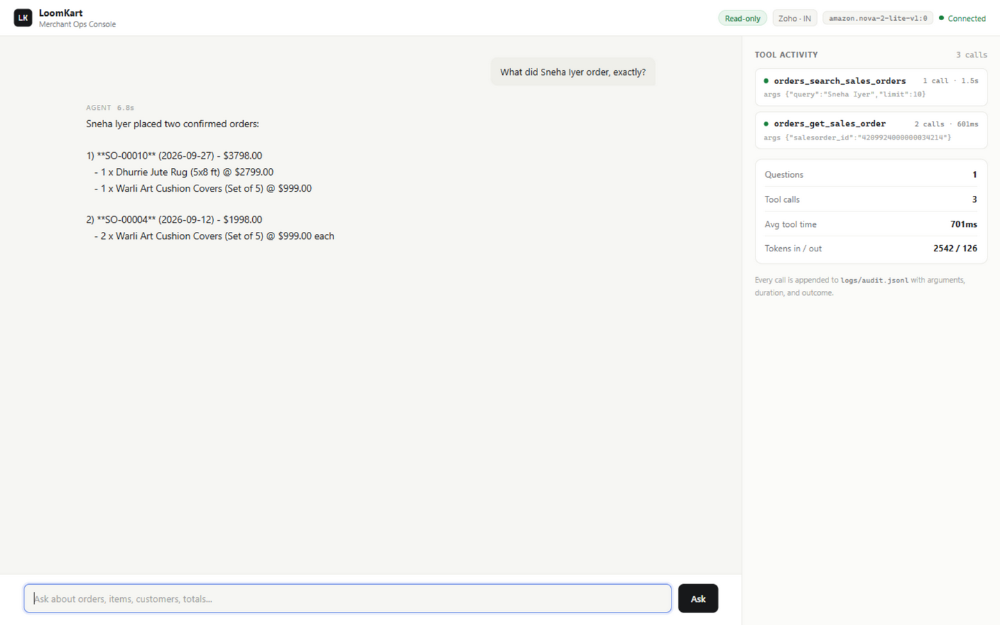
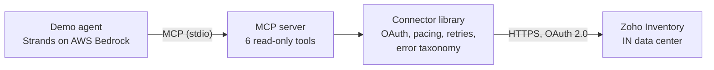

# Zoho Inventory MCP Connector

[](https://github.com/Prakhar2025/zoho-inventory-mcp/actions/workflows/ci.yml)

A production-grade, read-only Model Context Protocol (MCP) connector that lets a commerce
agent read items and sales orders from a Zoho Inventory organization: full OAuth 2.0,
rate-limit handling, structured errors, an audit log, and an eval suite.

Built as the assignment submission for the **Forward Deployed Engineer, Agent Studio** role
at Razorpay.

Demo video: [Watch 75-second walkthrough](https://github.com/user-attachments/assets/4be3b703-05f3-499e-9593-941cc8701109) (script in [docs/05-DEMO-VIDEO-SCRIPT.md](docs/05-DEMO-VIDEO-SCRIPT.md)).

## The merchant problem this solves

A D2C merchant runs their store on Zoho Inventory. They want an agent that answers their
team's questions directly: "what did Sneha Iyer buy?", "is the Jaipur bedsheet in stock?",
"which orders are still waiting for fulfillment?". Today every answer needs someone to log
into Zoho and click around. The connector is the missing pipe: it gives the agent safe,
read-only access to the merchant's own data, so the questions become one message instead
of a login, a search, and a screenshot.

## The demo, in 2 minutes

https://github.com/user-attachments/assets/4be3b703-05f3-499e-9593-941cc8701109

The video above the fold (1m 15s, narrated) walks through the problem, a live session of the
console answering three merchant questions while tool calls stream into the trace panel, and the
engineering that makes it trustworthy. Raw file in [docs/demo/zohomcp-demo.mp4](docs/demo/zohomcp-demo.mp4).



## What ships in this repo

| Piece | What it is |
| --- | --- |
| Connector library | Async Zoho Inventory client: OAuth with single-flight refresh, client-side pacing, 429 backoff honoring Retry-After, error taxonomy the agent can react to |
| MCP server | Six read-only tools over stdio, each annotated `readOnlyHint`, every call written to a JSONL audit log |
| Demo agent | Strands agent on AWS Bedrock answering real merchant questions through the tools ([transcript](agent/transcript.md)) |
| Merchant console | One-page ops UI: chat with the agent while every tool call streams into a live trace panel ([screenshot](docs/demo/console.png)) |
| AWS hosting stack | Probe-driven CloudFormation (S3 + CloudFront + API Gateway + Lambda) with deploy and teardown scripts in [infra/](infra/README.md) |
| Eval suite | 16 merchant questions scored on tool usage and answer facts: [16/16 pass](evals/report.md) |
| Test suite | 48 hermetic unit tests (mocked HTTP), plus live and protocol-level smoke scripts |

## Quickstart (about 10 minutes)

Prerequisites: Python 3.12, a free Zoho account, no credit card. No Docker needed.

1. Clone and install:

   ```bash
   git clone https://github.com/Prakhar2025/zoho-inventory-mcp.git
   cd zoho-inventory-mcp
   py -3.12 -m venv .venv && source .venv/Scripts/activate
   pip install -e ".[dev,agent,evals]"
   ```

2. Create a free Zoho Inventory org on the India data center
   (zoho.com/in/inventory, choose the Free plan).

3. At api-console.zoho.in create a **Self Client**, and put its id and secret in `.env`
   (copy from `.env.example`).

4. In the Self Client's "Generate Code" tab, paste the read-only scope string printed by:

   ```bash
   python scripts/get_refresh_token.py
   ```

   Generate a 10-minute code, then exchange it:

   ```bash
   python scripts/get_refresh_token.py <grant_code>
   ```

   The script saves a long-lived refresh token and your org id into `.env`.

5. Seed a fictional catalog (customers, items, orders; needs one more generated code with
   the write scopes the script prints):

   ```bash
   python scripts/seed_demo_data.py <grant_code>
   ```

6. Verify the connector, then drive it as an agent:

   ```bash
   python scripts/smoke_live.py      # list and search against the live org
   python scripts/smoke_mcp.py       # boots the MCP server, connects a real MCP client
   python agent/demo.py              # Bedrock agent answers 3 merchant questions
   python evals/run_evals.py         # 16 scored merchant cases
   ```

Any MCP client can also use the server directly: run `python -m zoho_inventory_mcp` and
point the client at it over stdio.

### Merchant console

```bash
.venv/Scripts/python -m uvicorn console.backend:app --port 8630
```

Open http://127.0.0.1:8630. Chat with the agent on the left; on the right, every tool
call streams in live with its arguments and durations, and session stats aggregate from
the same numbers the audit log records. No build step: the console is hand-crafted
HTML/CSS/JS served by the FastAPI backend, because a demo harness should not need a
node_modules folder.

## Architecture



Design decisions worth reading: [docs/01-ARCHITECTURE.md](docs/01-ARCHITECTURE.md) and
[docs/04-DECISIONS.md](docs/04-DECISIONS.md). The short version:

- **Read-only by design.** The OAuth scopes, the tool annotations, and the capabilities doc
  all enforce and declare that this connector can never mutate merchant data.
- **Rate limits enforced twice.** Calls are serialized with spacing client-side (the free
  plan allows 5 concurrent), and any server 429 is honored via Retry-After with exponential
  backoff and jitter.
- **Friendly identifiers.** Orders are fetched by internal id, SO number, or merchant
  reference; items by id or SKU. Agents think in merchant terms, so the tools do too.
- **Structured errors, not stack traces.** Rate-limit errors carry `retry_after_seconds`;
  auth errors tell the agent to stop.

## Quality signals

- 39 unit tests, fully hermetic (no network), covering token refresh races, retry policy,
  pagination, search relevance, and error mapping.
- 16 eval cases scored against the live agent on Bedrock: expected tools used, expected
  facts in the answer. Current run: 16/16 ([report](evals/report.md)).
- Protocol smoke: a real MCP client initializes a session over stdio, lists the six tools,
  and calls them against the live org.

## What the agent can and cannot do

The required short document is [docs/CAPABILITIES.md](docs/CAPABILITIES.md). The headline:
the agent can read the catalog and sales orders six ways, and it can never write, never
touch another organization, and never leave an untraced call behind.

## Limitations, honestly

- Zoho free-plan orgs do not expose stock levels for API-created items, so stock answers
  depend on the org's inventory tracking settings (fields stay optional in the models).
- The connector is single-org by design; a multi-tenant deployment adds an id-to-token map
  and per-tenant rate budgets (sketched in the architecture doc).
- All demo data is fictional. The seeding token has write scopes and should be revoked
  after seeding; the connector itself holds read-only scopes only.
- Local stdio transport suits single-user use; a hosted deployment would run the same
  server as a streamable HTTP endpoint behind authentication.

## How impact would be measured

Deployed for a merchant, this connector's value shows up in three numbers:

1. **Deflection rate**: share of merchant questions answered by the agent with zero human
   lookup (measured against the audit log: questions answered without escalation).
2. **Time to answer**: seconds from question to cited answer, versus minutes of manual
   Zoho lookups.
3. **Coverage**: which question types the six tools cover, and which new tools (for
   example shipments or invoices) would raise coverage next.
