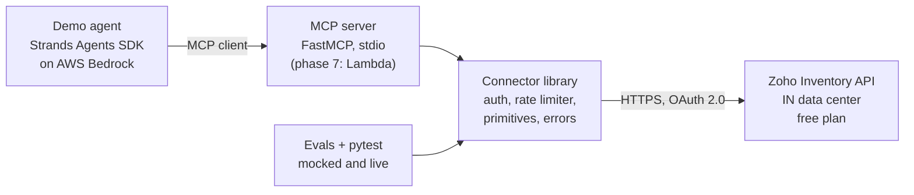

# Architecture

## System at a glance



The MCP server is the boundary. Everything above it (any agent, any MCP client) can use the tools
without knowing anything about Zoho. Everything below it is a plain, testable Python library.

## Components

### 1. Connector library (`src/zoho_inventory_mcp/`)

| Module | Responsibility |
| --- | --- |
| `config.py` | Settings from environment / `.env` (pydantic-settings), DC-aware base URLs |
| `auth.py` | OAuth 2.0: access token cache, auto-refresh on expiry or 401, one-flight refresh |
| `rate_limiter.py` | Client-side token bucket (spacing + concurrency 1), honors 429 Retry-After |
| `client.py` | httpx client: timeouts, retries with backoff and jitter, pagination, org id header |
| `models.py` | Pydantic models for Item and SalesOrder (normalized, documented fields only) |
| `errors.py` | Error taxonomy: `AuthError`, `RateLimitError`, `NotFoundError`, `ValidationError`, `UpstreamError` |
| `audit.py` | JSONL audit log: tool name, args, duration, outcome (no secrets, no tokens) |
| `server.py` | FastMCP server exposing the read-only tools |

### 2. MCP tools (the tool specification, phase 3)

Six read-only tools. Descriptions are written for an LLM consumer: when to use each, what the
parameters mean, what comes back, and what errors mean. That documentation *is* the MCP tool
specification, and it lives in code where it cannot drift.

- `inventory_list_items`: list items, paginated, optional name/sku filter
- `inventory_get_item`: get one item by id
- `inventory_search_items`: search items by keyword (name, sku, description)
- `orders_list_sales_orders`: list sales orders, paginated, optional status filter
- `orders_get_sales_order`: get one sales order by number or id
- `orders_search_sales_orders`: search sales orders by keyword (customer name, order number)

### 3. Demo agent (phase 4)

A small CLI built on the Strands Agents SDK (AWS's open-source agent SDK, where we have an open
pull request) with an MCP client pointed at our server and an AWS Bedrock model. It answers three
scripted merchant questions end to end and saves the transcript.

### 4. Evals (phase 5)

15 to 20 natural-language cases in YAML: question, expected tool calls in order, and assertions on
the final answer. One command runs them and prints a pass rate. Almost no other submission will
include this.

### 5. AWS layer (phase 7, optional differentiator)

Zip-deploy the MCP server to AWS Lambda with a Function URL (streamable HTTP MCP endpoint), secrets
in AWS Secrets Manager, logs and metrics in CloudWatch, infrastructure as a CloudFormation template.
No Docker needed: the dependencies are pure Python. Includes a teardown script for cost hygiene.

## Key design decisions

- **Read-only by design.** The agent cannot modify merchant data. This is a safety posture, not a
  limitation to hide: it is stated up front in the capabilities doc.
- **Full OAuth 2.0, not a static key.** Zoho Inventory only supports OAuth for the API anyway, so
  the connector implements grant-code exchange once, then auto-refreshes access tokens (they last
  about an hour) with a one-flight guard against concurrent refreshes.
- **Rate limits enforced twice.** Zoho free plan allows 1,000 calls per day and 5 concurrent calls.
  The client enforces spacing and serial requests locally, and still handles server-side 429s by
  honoring `Retry-After` with exponential backoff and jitter.
- **Error taxonomy the agent can react to.** A rate-limit error tells the agent to retry later; an
  auth error tells it to stop; a not-found error tells it to rephrase. Tools return structured
  errors instead of stack traces.

## Example data flow

Question: "How many orders are still unfulfilled?"

1. The agent selects `orders_list_sales_orders` with a status filter for unfulfilled orders.
2. The connector checks the local rate budget, refreshes the access token if stale, and calls the
   Zoho API with the org id header.
3. Responses are normalized into pydantic models; pagination is followed until complete.
4. The agent answers with counts and order numbers, citing which tool calls it made.

## Security posture

- Secrets only via `.env` (gitignored) or AWS Secrets Manager in the deployed variant.
- Least privilege: OAuth scopes limited to read access to items and sales orders (exact scope
  strings verified and recorded in phase 1).
- Every tool call is appended to a local JSONL audit log: timestamp, tool, arguments, duration,
  outcome. No tokens, no secrets.
- Demo data is fictional. The capabilities doc states what a production deployment would additionally
  need: field-level PII controls and tenant isolation.

## Repository layout

```
FDE Razorpay/
├── README.md
├── pyproject.toml
├── .env.example
├── docs/
│   ├── 00-PROJECT-BRIEF.md
│   ├── 01-ARCHITECTURE.md
│   ├── 02-ROADMAP.md
│   ├── 03-HANDOVER.md
│   ├── 04-DECISIONS.md
│   └── CAPABILITIES.md          (phase 6)
├── scripts/
│   ├── get_refresh_token.py     (phase 1: one-time OAuth grant-code exchange)
│   ├── seed_demo_data.py        (phase 1: create fictional items and orders)
│   └── smoke_live.py            (phase 2: quick live verification)
├── src/zoho_inventory_mcp/
│   ├── config.py, auth.py, rate_limiter.py, client.py
│   ├── models.py, errors.py, audit.py
│   └── server.py
├── agent/
│   └── demo.py                  (phase 4)
├── evals/
│   ├── cases.yaml               (phase 5)
│   └── run_evals.py             (phase 5)
├── infra/                       (phase 7, optional: CloudFormation template)
└── tests/
```
